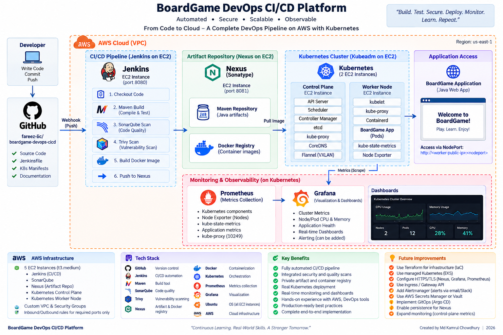

# 🎲 End-to-End DevSecOps CI/CD Platform for BoardGame

[🌐 View My Portfolio Website](https://fareez-lic.github.io/My-portofolio-html-/)

> A hands-on DevOps portfolio project that builds, scans, packages, stores, deploys, and monitors a Java web application using Jenkins, Maven, SonarQube, Trivy, Nexus, Docker, Kubernetes, Prometheus, and Grafana on AWS EC2.

## 📌 Project Overview

This project demonstrates an end-to-end DevSecOps workflow on AWS. Source code is stored in GitHub and built by Jenkins. Maven compiles and tests the Java application, Trivy performs filesystem and container-image vulnerability scans, SonarQube performs code-quality analysis, Nexus stores Maven artifacts and Docker images, Kubernetes runs the containerized application, and Prometheus/Grafana provide monitoring and visualization.

The original training material defines a Jenkins pipeline containing checkout, compile, test, filesystem scanning, SonarQube analysis, packaging, Nexus publication, Docker build/image scan/push, and Kubernetes deployment. This implementation follows that overall learning objective while adapting several details to the actual AWS/kubeadm environment used for this portfolio.

## 🏗️ Architecture



### End-to-End Flow

```text
Developer
   │
   ▼
GitHub
   │
   ▼
Jenkins
   ├── Maven Compile
   ├── Maven Test
   ├── Trivy Filesystem Scan
   ├── SonarQube Analysis
   ├── Maven Package
   ├── Publish JAR → Nexus Maven Repository
   ├── Docker Build
   ├── Trivy Image Scan
   └── Push Image → Nexus Docker Registry
                         │
                         ▼
                 Kubernetes (kubeadm)
                 ├── Control Plane
                 └── Worker
                         │
                         ▼
                   BoardGame App
                         │
              ┌──────────┴──────────┐
              ▼                     ▼
          Prometheus             Grafana
          Metrics                Dashboards
```

## 🧰 Technology Stack

| Area | Technology | Purpose |
|---|---|---|
| Cloud | AWS EC2 | Hosts all project servers |
| Source Control | Git & GitHub | Version control and source repository |
| CI/CD | Jenkins | Pipeline automation |
| Build | Maven | Compile, test, and package Java application |
| Code Quality | SonarQube | Static analysis and quality checks |
| Security | Trivy | Filesystem and Docker image vulnerability scanning |
| Artifact Management | Sonatype Nexus | Maven artifact and private Docker registry |
| Containers | Docker | Application containerization |
| Orchestration | Kubernetes / kubeadm | Application deployment and orchestration |
| Runtime | containerd | Kubernetes container runtime |
| Networking | Flannel VXLAN | Kubernetes pod networking |
| Monitoring | Prometheus | Metrics collection |
| Visualization | Grafana | Kubernetes dashboards |
| OS | Ubuntu Server 24.04 LTS | EC2 operating system |

## ☁️ AWS Infrastructure

The lab uses the **default AWS VPC** and five EC2 instances.

| Server | Role | Main Service |
|---|---|---|
| Jenkins Server | CI/CD automation | Jenkins :8080 |
| SonarQube Server | Code analysis | SonarQube :9000 |
| Nexus Server | Artifact + image repository | Nexus :8081 |
| Kubernetes Control Plane | Cluster management | kubeadm / API server |
| Kubernetes Worker | Application workloads | BoardGame pods + NodePort |

The instances were intentionally separated to make the responsibilities and service-to-service communication easier to understand and troubleshoot.

### Security Group Design

Access is restricted wherever practical:

- SSH and browser-facing administration ports are limited to the administrator's IP.
- Kubernetes service-to-service rules use security-group references.
- Flannel VXLAN uses UDP `8472` between Kubernetes nodes.
- Kubernetes API traffic uses TCP `6443`.
- Kubelet uses TCP `10250`.
- Kubernetes NodePort range `30000-32767` is restricted to the administrator's IP for this lab.
- Nexus access from Jenkins/Kubernetes is restricted through appropriate security-group rules.

> **Security note:** Public IPs, AWS account identifiers, passwords, tokens, kubeadm tokens, and private keys must never be committed to this repository.

## 🔄 Jenkins CI/CD Pipeline

The working Jenkins pipeline contains the following stages:

1. **Checkout** — retrieves the source from GitHub.
2. **Compile** — runs `mvn clean compile`.
3. **Test** — runs `mvn test`.
4. **Trivy Filesystem Scan** — scans the source tree for HIGH/CRITICAL findings.
5. **SonarQube Analysis** — submits the Maven project to SonarQube.
6. **Package** — creates the application JAR with Maven.
7. **Upload Artifact to Nexus** — publishes the Maven snapshot artifact.
8. **Docker Build** — builds `boardgame:latest`.
9. **Trivy Image Scan** — scans the built container image.
10. **Push Docker Image to Nexus** — tags and publishes the image to the private Nexus Docker repository.

### Jenkins Runtime vs Build JDK

A useful lesson from this project was that the Jenkins server itself and the application being built do not have to use the same Java version.

- Jenkins runtime: **Java 21**
- Application build tool configured in Jenkins: **JDK 11**
- Maven: **3.8.7**

This resolved the Java compatibility problem encountered during the first builds.

## 🔍 SonarQube

SonarQube Community Edition runs as a Docker container on its own EC2 instance. Jenkins connects to it using its private AWS address and a Jenkins secret-text credential.

The analysis initially failed for two separate reasons:

- The Jenkins SonarQube installation name did not match the case used by the Jenkinsfile.
- `mvn sonar:sonar` could not resolve the plugin prefix in this environment.

The final pipeline uses the correctly named Jenkins installation and a fully qualified Maven Sonar plugin invocation. The analysis then completed successfully and the quality gate passed.

## 🛡️ Trivy Security Scanning

Trivy is integrated at two points:

```text
Source Code → Trivy Filesystem Scan
Docker Image → Trivy Image Scan
```

This demonstrates a basic **shift-left security** approach: vulnerabilities are checked before deployment rather than waiting until the application is already running.

## 📦 Nexus Repository

Nexus performs two jobs.

### Maven Artifact Repository

The packaged Java artifact is uploaded to the hosted repository:

```text
boardgame-snapshots
```

The Maven project uses a `SNAPSHOT` version, and Jenkins authenticates to Nexus using a Jenkins-managed username/password credential.

### Private Docker Registry

A hosted Docker repository named:

```text
boardgame-docker
```

stores the application container image.

The modern Nexus **path-based Docker routing** approach is used through port `8081`, avoiding the need to recreate the existing Nexus container simply to expose a separate legacy Docker connector port.

## 🐳 Docker

Jenkins builds the application image and publishes it to Nexus.

Conceptually:

```text
Source + Dockerfile
        │
        ▼
   Docker Build
        │
        ▼
   Trivy Image Scan
        │
        ▼
 Nexus Docker Registry
```

Because this lab registry uses HTTP internally rather than production TLS, Docker/containerd required explicit private-registry configuration.

> Production environments should use HTTPS/TLS and dedicated service credentials.

## ☸️ Kubernetes Cluster

The application runs on a self-managed **two-node kubeadm cluster**:

```text
Kubernetes v1.35.8

Control Plane
└── Cluster management components

Worker
└── BoardGame application pods
```

The cluster uses:

- `containerd` as the runtime
- `SystemdCgroup = true`
- Flannel as the CNI
- Pod CIDR `10.244.0.0/16`
- NodePort for external lab access

Both nodes reached `Ready` status.

### Why NodePort Instead of LoadBalancer?

The original application manifest used a `LoadBalancer` Service. This project uses kubeadm directly on EC2 rather than EKS with an AWS load-balancer integration, so the application Service was changed to:

```yaml
type: NodePort
```

That provided a simple, appropriate way to demonstrate external access in this lab.

## 🚀 Application Deployment

The Kubernetes Deployment runs two BoardGame replicas.

The image is pulled from the private Nexus registry. During troubleshooting, the image was successfully pulled into containerd's `k8s.io` namespace and the deployment used:

```yaml
imagePullPolicy: IfNotPresent
```

The final application reached:

```text
2 replicas
2 Running pods
```

and the BoardGame web interface loaded successfully through the worker NodePort.

## 📊 Monitoring & Observability

Monitoring was installed into the Kubernetes cluster with Helm using `kube-prometheus-stack`.

The monitoring namespace includes:

- Prometheus
- Grafana
- Alertmanager
- kube-state-metrics
- Prometheus Node Exporter
- Prometheus Operator

Grafana successfully displays real Kubernetes metrics including:

- Node count
- Pod count
- CPU usage
- Memory usage
- Cluster resource requests
- Node health

Prometheus also successfully scrapes multiple Kubernetes and monitoring targets.

## 🧯 Troubleshooting & Lessons Learned

This project involved substantial real-world troubleshooting. The problems were not hidden; they are documented because diagnosing them was one of the most valuable parts of the project.

| Issue | Root Cause | Resolution |
|---|---|---|
| Jenkins initially failed with Java compatibility problems | Current Jenkins required Java 21 while the application build behaved correctly with JDK 11 | Kept Jenkins runtime on Java 21 and configured JDK 11 as the application build tool |
| SonarQube pipeline failed | Jenkins installation name/case mismatch | Corrected the installation name to `SonarQube` |
| Sonar Maven command failed | Maven could not resolve the `sonar` plugin prefix | Used the fully qualified Sonar Maven plugin coordinates |
| Jenkinsfile failed to parse | Accidental pipeline syntax typo | Corrected the Jenkinsfile and rebuilt |
| SonarQube/Nexus stopped after EC2 restart | Docker containers were not automatically restarting | Applied Docker `unless-stopped` restart policy |
| Nexus Docker login returned `401` | Docker Bearer Token Realm configuration had not been saved | Saved the realm configuration and authenticated again |
| Kubernetes could not initially pull the private Nexus image | HTTP registry/containerd configuration and private-registry authentication required additional setup | Configured containerd registry hosts, Kubernetes registry credentials, and verified manual containerd pull |
| Nexus returned `429 Too Many Authentication Attempts` | Nexus authentication rate limiting was triggered during repeated Kubernetes pull attempts | Disabled rate limiting for this isolated lab and used the verified cached image with `IfNotPresent` |
| Application Service design did not fit kubeadm | `LoadBalancer` expected cloud LB integration | Replaced it with `NodePort` |
| Grafana dashboard showed plugin/query errors | Grafana could not reach Prometheus reliably because Kubernetes DNS was failing | Traced the failure through Prometheus, DNS, CoreDNS, and cross-node networking |
| Kubernetes DNS timed out | Worker pods could not communicate with CoreDNS pods running on the control plane | Diagnosed the Flannel cross-node network |
| Cross-node pod traffic had 100% packet loss | AWS Security Group had **UDP 8427** instead of Flannel VXLAN **UDP 8472** | Corrected the SG port to `8472`; cross-node ping immediately changed to 0% packet loss and DNS began working |
| kube-proxy Prometheus target was DOWN | Metrics were bound to localhost and TCP `10249` was not reachable from the worker | Set `metricsBindAddress` to `0.0.0.0:10249`, restarted kube-proxy, and allowed TCP `10249` from the worker SG |
| Some Prometheus control-plane targets remain DOWN | kube-controller-manager, kube-scheduler, and etcd metrics endpoints are bound to `127.0.0.1` in this kubeadm setup | Intentionally left unchanged for this portfolio lab rather than exposing additional control-plane metrics endpoints solely to make every target green |

## ⚠️ Known Monitoring Limitation

A few Prometheus control-plane scrape targets remain DOWN.

Examples include:

- kube-controller-manager
- kube-scheduler
- etcd

Inspection showed these services listening on localhost-only metrics addresses such as:

```text
127.0.0.1:10257
127.0.0.1:10259
127.0.0.1:2381
```

Prometheus runs in a Kubernetes pod and therefore cannot scrape those endpoints through the control-plane node's private address.

This **does not mean Prometheus or Grafana is broken**. Prometheus is collecting metrics from many other targets, and Grafana is successfully rendering Kubernetes node, pod, CPU, and memory dashboards.

For this portfolio lab, those localhost bindings were intentionally left unchanged. A production monitoring design would configure control-plane metrics exposure deliberately, secure access with appropriate network policies/firewall rules, and avoid opening sensitive endpoints simply to obtain an all-green demo screen.

## 🔐 Security Considerations

Security decisions demonstrated in this project include:

- Jenkins credentials instead of embedding Nexus/Sonar secrets in the Jenkinsfile.
- Private AWS addresses for service-to-service communication.
- AWS Security Groups restricting management and Kubernetes ports.
- SSH key authentication.
- Trivy scanning before deployment.
- Kubernetes image pull credentials.
- No private SSH keys committed to Git.

### Lab-Only Compromises

Some choices are acceptable for a learning environment but should be improved before production:

- Nexus registry uses HTTP internally.
- Nexus rate limiting was disabled during private-registry troubleshooting.
- Administrative Nexus credentials were used during parts of the lab.
- Services such as Grafana/Prometheus are exposed using NodePort for demonstration.
- Nexus was initially created without an explicit persistent Docker volume.
- AWS infrastructure was created manually rather than through IaC.

## 🏭 What I Would Change for Production

A production version would add:

- Terraform for AWS infrastructure as code
- EKS or a hardened Kubernetes architecture
- HTTPS/TLS for Jenkins, Nexus, SonarQube, Grafana, and Prometheus
- Ingress/Gateway API instead of direct NodePort exposure
- Dedicated Nexus service accounts/tokens
- AWS Secrets Manager or HashiCorp Vault
- Persistent external storage and backup strategy for Nexus
- Argo CD for GitOps continuous delivery
- Alertmanager notification routing
- Properly secured control-plane metrics
- NetworkPolicies
- Automated certificate management
- Centralized logging
- High availability and autoscaling
- Versioned Docker image tags instead of relying only on `latest`

## 📸 Portfolio Evidence

Suggested screenshot order:

```text
01-jenkins-ec2-running.png
02-jenkins-ssh-connected.png
03-jenkins-service-running.png
04-jenkins-dashboard.png
05-sonarqube-ec2-running.png
06-sonarqube-docker-running.png
07-sonarqube-container-running.png
08-sonarqube-dashboard.png
09-nexus-ec2-running.png
10-nexus-docker-running.png
11-nexus-container-running.png
12-nexus-dashboard.png
13-k8s-control-plane-ec2-running.png
14-k8s-control-plane-k8s-versions.png
15-k8s-worker-ec2-running.png
16-k8s-worker-k8s-versions.png
17-k8s-cluster-nodes-ready.png
18-jenkins-maven-pipeline-success.png
19-jenkins-sonarqube-quality-gate-passed.png
20-jenkins-trivy-pipeline-success.png
21-nexus-boardgame-artifact-uploaded.png
22-jenkins-docker-trivy-image-scan-success.png
23-nexus-docker-image-pushed.png
24-jenkins-nexus-docker-push-success.png
25-boardgame-kubernetes-deployment-live.png
26-grafana-kubernetes-nodes-monitoring.png
27-prometheus-kubernetes-targets-up.png
28-prometheus-healthy-targets.png
```

> Before publishing screenshots, redact public/private IP addresses where appropriate, AWS account information, instance IDs, passwords, tokens, and other credentials.

## 🎯 What This Project Demonstrates

This project demonstrates practical experience with:

- Building a multi-stage Jenkins pipeline
- Java/Maven CI workflows
- Static code-quality analysis
- DevSecOps vulnerability scanning
- Artifact repository management
- Private container registries
- Docker image lifecycle
- Kubernetes administration with kubeadm
- Kubernetes networking and DNS troubleshooting
- AWS Security Group troubleshooting
- Prometheus metrics collection
- Grafana observability dashboards
- Debugging failures across application, container, network, cloud, and orchestration layers

## 📚 Key Lessons

The biggest lesson was that DevOps is not simply installing tools. The difficult—and valuable—part is understanding how the tools communicate.

A Grafana error eventually led through:

```text
Grafana
  ↓
Prometheus connectivity
  ↓
Kubernetes Service DNS
  ↓
CoreDNS
  ↓
Cross-node pod networking
  ↓
Flannel VXLAN
  ↓
AWS Security Group
  ↓
Wrong port: 8427
  ↓
Correct port: 8472
```

That troubleshooting chain turned a simple dashboard error into a practical lesson in observability, Kubernetes networking, CNI behavior, DNS, and AWS networking.

## 🙏 Attribution

The Java BoardGame application used as the workload for this DevOps project was originally created by **Aditya Jaiswal**:

`https://github.com/jaiswaladi246/Boardgame`

The DevOps infrastructure, CI/CD implementation, AWS environment, Nexus integration, Kubernetes deployment, monitoring setup, troubleshooting, and portfolio documentation in this repository were built as a hands-on learning project by **Md Kamrul Chowdhury**.

## 👤 Author

**Md Kamrul Chowdhury**  
DevOps & Cloud Engineering Portfolio

---

### Project Status

**CI/CD:** ✅ Working  
**Security Scanning:** ✅ Working  
**Nexus Artifact Publishing:** ✅ Working  
**Private Docker Registry:** ✅ Working  
**Kubernetes Deployment:** ✅ Working  
**BoardGame Application:** ✅ Running  
**Prometheus:** ✅ Collecting Metrics  
**Grafana:** ✅ Displaying Kubernetes Dashboards  
**Control-Plane Metrics:** ⚠️ Partially limited by localhost-only endpoints

> **Build. Test. Secure. Deploy. Monitor. Learn. Repeat.**
